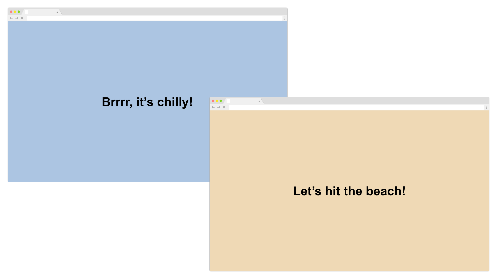
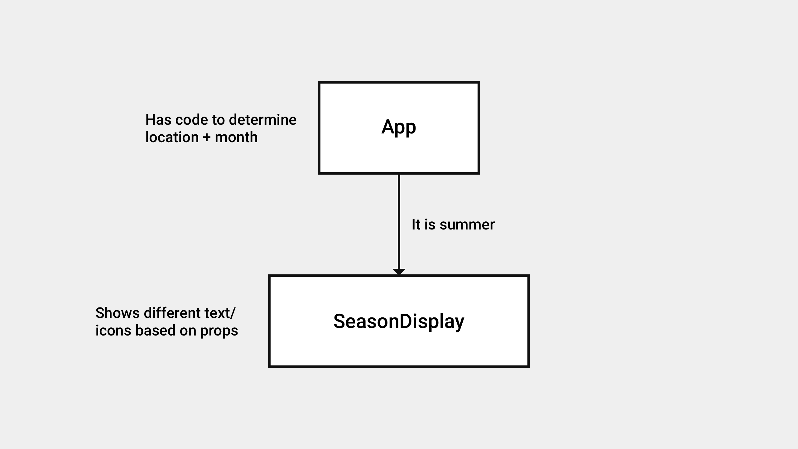

build-lists: true
slidenumbers: true
footer: IDM 364: Introduction to React
autoscale: true
theme: Work, 1

# Forecast Exercise

---

---

[.build-lists: false]

## Scaffold the App

Winter, if the user is:

- in northern hemisphere and between October and March
- in southern hemisphere and between March and October

Summer, if the user is:

- in northern hemisphere and between March and October
- in southern hemisphere and between October and March

---

## App Challenges

- need user's physical location
- need to determine the current month
- need to change text and style based on location & month

---

---

## Rules

- one hour or less
- teams of 2
- worth 5 bonus points towards final grade