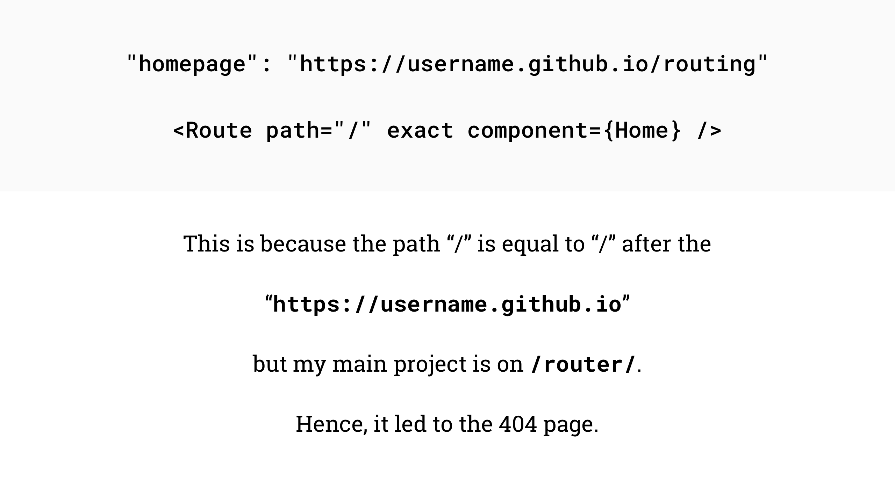

# React Router Exercise

## Create App

```bash
yarn create react-app routing
rm public/favicon.ico public/manifest.json
rm src/*

# Tori's Note:
# Deleting GIT config for example
# Don't actually do this
rm -rf .git
```

## Update `package.json`

```json
"start": "BROWSER='Firefox Nightly' react-scripts start",
```

## Add React Router DOM

```bash
yarn add react-router-dom
```

## Create Entry Point

- `src/index.js`

```javascript
import React from 'react';
import ReactDOM from 'react-dom';

ReactDOM.render(<App />, document.getElementById('root'));
```

## Add `<Router>` to `index.js`

```diff
import React from 'react';
import ReactDOM from 'react-dom';
+ import { BrowserRouter as Router } from 'react-router-dom';
import App from './components/App';

ReactDOM.render(
+ <Router>
    <App />
+ </Router>,
  document.getElementById('root')
);
```

## Create `components/App.js`

```javascript
import React from 'react';

class App extends React.Component {
  render() {
    return (
      <h1>Hello World</h1>
    );
  }
}

export default App;

```

## Add UI Components To `components/App.js`

```javascript
const Home = () => (
  <div>
    <h2>Home</h2>
  </div>
);

const Airport = () => (
  <div>
    <ul>
      <li>Alvin</li>
      <li>Simon</li>
      <li>Theo</li>
    </ul>
  </div>
);

const City = () => (
  <div>
    <ul>
      <li>Philly</li>
      <li>New York</li>
      <li>Boston</li>
    </ul>
  </div>
);
```

## Setup Routes `components/App.js`

```diff
import React from 'react';
+ import { Route, Link } from 'react-router-dom';
```

```diff
class App extends React.Component {
  render() {
    return (
-     <h1>Hello World</h1>
+      <>
+        <nav>
+          <ul>
+            <li>
+              <Link to="/">Home</Link>
+            </li>
+            <li>
+              <Link to="/airports">Airports</Link>
+            </li>
+            <li>
+              <Link to="/cities">Cities</Link>
+            </li>
+          </ul>
+        </nav>

+        <Route path="/" component={Home} />
+        <Route path="/airports" component={Airport} />
+        <Route path="/cities" component={City} />
+      </>
    );
  }
}
```

## Add `exact` Prop To Home Route

Home which is the UI for Home component should be rendered only on the `/`, root route. However, it is rendered on all the routes. The `/` matches `/airports` and `/cities` routes, therefore rendering its component in these two other routes. The solution to this is to simply add the `exact` prop to the `/` route.

```diff
- <Route path="/" component={Home} />
+ <Route path="/" exact component={Home} />
```

## Move Nav To Separate Component

```diff
import React from 'react';
- import { Route, Link } from 'react-router-dom';
+ import { Route, Switch } from 'react-router-dom';
import Nav from './Nav';

// --------

class App extends React.Component {
  render() {
    return (
      <>
-        <nav>
-          <ul>
-            <li>
-              <Link to="/">Home</Link>
-            </li>
-            <li>
-              <Link to="/airports">Airports</Link>
-            </li>
-            <li>
-              <Link to="/cities">Cities</Link>
-            </li>
-          </ul>
-        </nav>
+       <Nav />

+       <Switch>
          <Route path="/" component={Home} />
          <Route path="/airports" component={Airport} />
          <Route path="/cities" component={City} />
+       </Switch>
      </>
    );
  }
}
```

## Create `components/Nav.js`

```javascript
import React from 'react';
import { Link } from 'react-router-dom';

const Nav = () => (
  <nav>
    <ul>
      <li>
        <Link to="/">Home</Link>
      </li>
      <li>
        <Link to="/airports">Airports</Link>
      </li>
      <li>
        <Link to="/cities">Cities</Link>
      </li>
    </ul>
  </nav>
);

export default Nav;
```

## Add Bill Murray Pictures

`public/images/`

- `components/Bill.js`

```javascript
import React from 'react';

const Bill = () => (
  <div>
    
    
    
    
  </div>
);

export default Bill;
```

## Update Router

```diff
import React from 'react';
import { Route } from 'react-router-dom';
import Nav from './Nav';
+ import Bill from './Bill';
```

```diff
<>
  <Nav />
  <Route path="/" exact component={Home} />
  <Route path="/airports" component={Airport} />
  <Route path="/cities" component={City} />
+ <Route path="/bill" component={Bill} />
</>
```

```diff
<li>
    <Link to="/cities">Cities</Link>
  </li>
+ <li>
+   <Link to="/bill">Bill</Link>
+ </li>
</ul>
```

---

## Deploy to Github Pages

Everything to this point is working locally. Now let's follow the setup to host the app on Github Pages.

### Create Github Repo

1. create a new repo
2. add remote information to local repository
3. commit and push to master branch

### Add `gh-pages` Package

```bash
yarn add gh-pages
```

## Add Deploy Scripts

```diff
"scripts": {
+ "predeploy": "npm run build",
+ "deploy": "gh-pages -d build",
  "start": "react-scripts start",
  "build": "react-scripts build",
```

### Update `homepage` Key

```diff
+ "homepage": "https://philsinatra.github.io/routing",
```

Here's the **PROBLEM**!

This is where most of our projects are failing. Once we deploy, the links no longer work properly/consistently, and when we refresh the page, we get a 404 error. Why?



This problem will exist any time there's a React app that uses Router and is deployed in a sub directory. There are a few options for dealing with this. Let's look at one solutions.

Before we deploy, let's make some of the adjustments we'll need.

### Add Public URL To Router

`BrowserRouter` comes with a prop called `basename` which allows you to define the base URL for the project.

- `src/index.js`

```javascript
<Router basename="">
```

Now we need a way to specify the base URL for the project. This value can differ based on if we're working locally or remotely. Luckily there's a configuration variable built into our build process that can tell if we're on a local or remote host, and therefore stores the base URL of where our app is running. We can tap into this variable.

```javascript
<Router basename={process.env.PUBLIC_URL}>
```

Next, we'll adjust our router to use a different component when handling our routes.

```diff
- import { BrowserRouter as Router } from 'react-router-dom';
+ import { HashRouter as Router } from 'react-router-dom';
```

### Deploy

```bash
yarn run deploy
```

## References

- [https://auth0.com/blog/react-router-4-practical-tutorial/](https://auth0.com/blog/react-router-4-practical-tutorial/)
- [https://medium.com/@Dragonza/react-router-problem-with-gh-pages-c93a5e243819](https://medium.com/@Dragonza/react-router-problem-with-gh-pages-c93a5e243819)
- [https://levelup.gitconnected.com/deploying-a-create-react-app-with-routing-to-github-pages-f386b6ce84c2](https://levelup.gitconnected.com/deploying-a-create-react-app-with-routing-to-github-pages-f386b6ce84c2)